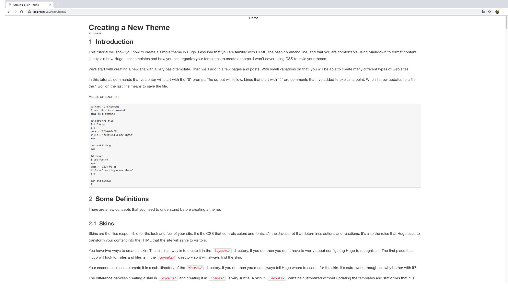

# hugo-bulma-simple
A super simple and minimal hugo theme build on bulma css.

## ScreenShot




## Useage

```
git clone https://github.com/nerdneilsfield/hugo-bulma-simple.git themes/bulma-simple
copy themes/bulma-simple/config.toml .
```